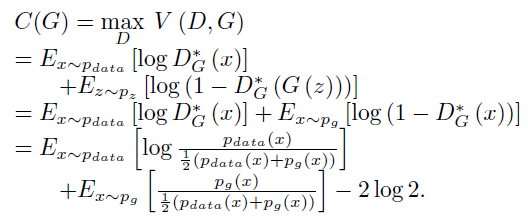
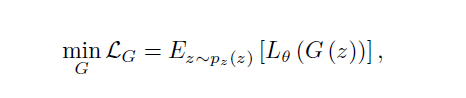
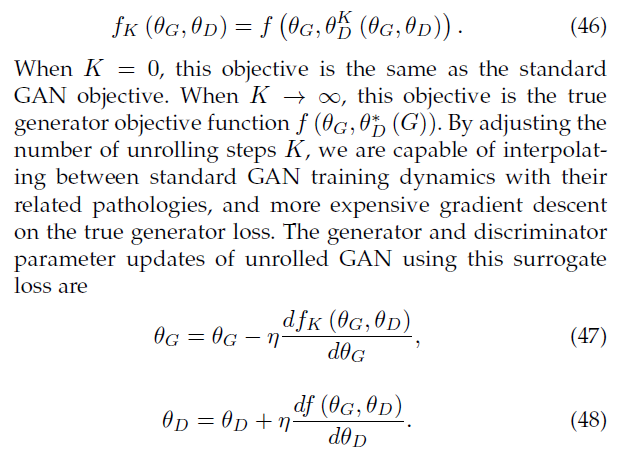
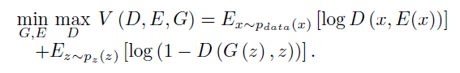

# A Review on Generative Adversarial Networks

## GAN的简介

本篇关于GAN的综述主要从算法,理论,应用等方面,对GAN的最新进展进行了介绍.GAN全称为Generative Adversarial Networks.GAN由两个部分组成:生成器(generator),判别器(discriminator).通常,生成器用于生成图片,而判别器则是用于鉴别生成的图片的真伪.生成器和判别器可以继承各种不同的模型结构.GAN的中心思想为对抗,即生成器对抗判别器,生成器的目的是尽可能生成真实的图片足以骗过判别器,而判别器则是尽可能判别出生成器生成的图片.GAN中的优化任务为minimax optimization任务.该优化终止于一个鞍点,该鞍点对于生成器而言是最小值,而对于鉴别器而言是最大值.

## 生成算法

共有两种生成算法:Explicit density model,Implicit density model.

### Explicit density model

较为常见的explicit density models有:maximum likelihood estimation (MLE), approximate inference, and Markov chain method.该算法的主要思想为:假设真实数据有着一定的分布情况,而我们则是训练模型去拟合分布情况.由于该算法主要是从真实数据中学习分布,因此导致生成的模型overly smooth(过于平滑?).由于目标函数难以求解,而我们所使用的近似推理算法只能接近目标函数的下限,而难以直接接近目标函数.

### Implicit density model

Implicit density model并不是直接的去拟合真实数据的分布,而是从分布中产生新的数据实例,并且利用产生的实例修改模型.GAN就属于这一模型

### GAN与其他算法的对比

1. GAN可以并行生成
2. GAN的生成器没有特别的要求
3. GAN可以产生更好的实例

## 对抗思想

### 应用领域

* 机器学习
* 人工智能
* 机器视觉
* 自然语言处理等

### 对抗实例

对抗实例是指与真实例子十分相近,只在光照,角度等方面进行改变,就被分为不同类的例子.或者是与实例完全没有任何关系就被分为同一类的例子,目前较为火爆的方向为against adversarial attacks.

### 对抗学习

对抗学习是一个minmax优化问题.GAN就是对抗学习的一个例子.

## 算法

### GANs

#### 目标函数

目标函数为

首先固定G,就可以求出D(x)为

接着再将D(x)带入就可以得到目标函数为

接着根据KL divergence与JS divergence的定义

带入上面的式子就可以得到

其中JS divergence表示了两种分布的关联程度,其中$0<JS divergence<log2$则当
$$
p_{data}=p_{g}时取得最小值,此时G可以被认为时完美的
$$

#### Non-saturating game

如图所示原始的目标函数存在一个问题:该目标函数在训练初期,由于梯度小,存在训练十分慢的问题,而在后期其梯度则较大.这与我们平时训练时,对下加速度先快后慢的要求完全不同,因此选择使用另一个目标函数.

这一目标函数解决了梯度的问题,但是目前并没有理论支持这一目标函数的可行性.同时该目标函数也有问题:在训练G时,该目标函数无法提供合适的梯度.带入$D_{G}^{*}$

从公式(12)可以看出存在的问题,为了最小化,首先第一部分KL divergence的目的是使得divergence尽可能得小,而第二部分得JS divergence则由于前面的减号,为使式子最小化,则是要使得divergence尽可能大.这使得这个这个目标函数的梯度不稳定.更严重的问题还有就是KL divergence是不对称的,而且存在过大的问题,如下

这两个问题导致,在产生特别差的样本时,损失会十分大,但是在产生一般的不真实的样本时,损失却是较小.因此模型会偏向于产生重复且安全的样本,而不是多样的样本.

#### Maximum likelihood game

函数如下

#### 对比

根据上图我们可以得出以下几个结论:

1. 在产生的样本比较假的时候,只有Non-saturating能产生比较好的梯度,而普通的和Maximum likelihood cost产生的梯度十分小
2. Maximum likelihood cost的梯度则主要来自于右边小部分,这使得在训练时,绝大多部分来自于少部分样本,这使得减少方差是提升效果的重要的部分
3. Non-saturating的样本方差较小这导致,Non-saturating的实际使用效果较好

### 有代表性的GAN模型

#### InfoGAN

InfoGAN 主要特点是对GAN进行了一些改动,成功地让网络学到了可解释的特征,网络训练完成之后，我们可以通过设定输入生成器的隐含编码来控制生成数据的特征.

作者将输入的噪声分成了两个部分:随机噪声z和隐变量c.其目标函数为

其中$I(c;G(z,c))$代表的是c与G(z,c)之间的互信息.互信息是两个随机变量之间依赖程度的度量,互信息越大就说明生成网络在根据c的信息生成数据时,隐编码c的信息损失越低,即生成数据保留的c的信息越多.由于真实的P(c|x)难以获得因此引入变分分布Q.式子变为

infoGAN的基础结构为

#### Conditional GAN

目标函数

Conditional GAN被用于许多地方,比如人脸生成,人脸老化,图片转化,合成具有特定风景属性的室外图像,自然图像描述,可感知3D的场景.

AC-GAN的目标函数共有两个部分

D被训练最大化$L+L_{C}$,G被训练最大化$L_{C}-L$

pix2pix目标函数

pix2pixHD的学习任务是multi-task learning problem

特征匹配损失

因此最终损失为

#### CycleGAN

由于配对数据较少,CycleGAN可以解决没有配对数据的问题.事实证明，循环一致性是条件熵的上限.

#### f-GAN

f-GAN说明了任何divergences都可以被用在GAN当中,f-GAN提出了一种新的f-divergences

#### Integral Probability Metrics

两种分布之间的IPM是

##### Maximum Mean Discrepancy (MMD)

其损失函数为

MMD被用于深度模型生成以及模型评价

##### Wasserstein GAN

WGAN将EM距离与较为普及的probability distances和divergences进行比较.EM距离为

在该论文中利用以下式子去逼近EM距离

最终WGAN目标函数为

WGAN与原始函数有着以下三个区别

1. WGAN的目标函数没有log
2. WGAN是一个回归问题,而原始的GAN是一个分类问题
3. WGAN中的D必须为K-Lipschitz,因此WGAN要使用权重裁剪

与传统的GAN相比WGAN可以提供更稳定的学习,但是要拟合 K-Lipschitz constraint十分困难,因此WGAN-GP利用梯度惩罚去限制K-Lipschitz constraint.目标函数变为

##### Loss Sensitive GAN

loss函数要满足以下限制

目标函数为

### GANs的训练

#### Objective function

##### LSGAN

loss

优势

1. 差的生成样本会基于更大的损失,这有利于产生好的样本
2. 可以克服梯度消失的问题

##### Hinge loss based GAN

##### Energy-based generative adversarial network

loss

EBGAN可以有更稳定的训练趋势

##### Boundary equilibrium generative adversarial networks (BEGAN)

BEGAN使用auto-encoder并且提出了equilibrium method去平衡生成器和判别器,使得训练更快更稳定

##### Mode regularized generative adversarial networks (MDGAN)

由于原始GAN在判别器高纬度空间特殊函数,GAN的训练不稳定.MDGAN的想法是使用encoder$E(x):x\rightarrow z$来创造一个z而不是使用随机噪声

MDGAN的优势有
1. encoder保证了x与E(x)的对应关系,使得G可以覆盖数据空间中的各种模式,防止了模式崩溃
2. 因为E的重构可以添加更多的信息,因此判别器更加难以判别

loss

##### Unrolled GAN

Metz et al. [27] introduce a technique to stabilize GANs by defining the generator objective with regard to an unrolled optimization of the discriminator(看不懂),unrolled GAN主要是用于解决模式崩溃,局部解可以看作是迭代过程中一个固定的点

##### Relativistic GANs (RGANs)

$$
D(x)=sigmoid(C(x))
$$
$$
\hat{x}=(x_r,x_g)
$$
x_r为真实图像,x_g为生成图像

Relativistic Standard GAN的损失函数为

绝大多数GAN的参数为

#### 训练技巧

Soumith Chintala提出了一篇文章”How to train a GAN.”这篇文章提出了许多训练技巧.相关的GitHub资源为[GitHub](https://github.com/soumith/ganhacks)

#### 结构

##### 原始GAN

原始的GAN用MLP作为判别器和生成器,MLP在生成复杂图片的时候表现不佳

##### Laplacian generative adversarial networks (LAPGAN) and SinGAN

LAPGAN由于使用了金字塔结构的CNN作为生成器,从而可以产生更高分辨率的图像.
SinGAN是从一个单一图像中学习,有着一个金字塔型卷积,每个层都学习从不同分辨率的图像学习一部分的分布.InGAN也从单个图像学习生成模型.

##### Deep convolutional generative adversarial networks (DCGANs)

由于在图片方面CNN的性能远远高于MLP因此使用CNN的DCGANs有着更好的效果,现有大部分GAN都基于DCGANs.DCGANs有着以下三个特点:
1. DCGANs的整体框架都由卷积组成,没有pooling和unpooling,需要增加空间维度时,使用转置卷积
2. 它将batch normalization使用到了生成器与判别器的各个层,但是D的第一层与G的最后一层没有使用,那样才能正确的理解真实数据的分布
3. 使用了Adam而不是SGD

##### Progressive GAN

PGGAN使用了progressive neural networks,PGGAN的中心思想是开始时判别器和生成器都只能处理低分辨率的图像,然后在训练过程中,增加层使得模型逐渐可以处理小的细节

##### Self-Attention Generative Adversarial Network(SAGAN)

SAGAN提出了使用注意力驱动和longrange dependency modeling来实现图片生成,SAGAN的生成器与判别器都使用了spectral normalization,发现spectral normalization可以提高训练情况,并且证明TTUR对SAGAN十分有效

##### BigGANs and StyleGAN

BigGANs可以产生高分辨率的图像,但是训练该模型需要大量的数据,因此后来基于BigGANS产生了一个BigBiGAN,BigBiGAN通过增加编码器将其拓展到了表示学习,并且修改了判别器.
StyleGAN可以产生高质量的图片,并且它可以把比如年龄,头发等因素分离开来进行生成从而产生高质量的模型.

##### Hybrids of autoencoders and GANs

Autoencoder分为两个部分,一个是解码器一个是译码器,解码器的目的是对数据进行解码,也就是对数据进行表示,降低维度,解码器则是重构数据.目的是结果解码和编码可以尽可能还原数据.

###### GANs with an autoencoder

* Adversarial autoencoder(AAE)
* Adversarial variational Bayes (AVB)
* variational autoencoders (VAEs)
* UNsupervised Image-to-image Translatio(UNIT)
* disentangled representation GAN (DR-GAN)

###### GANs with an encoder

由于原始的GANs没有能力,将输入的数据映射回latent space,因此产生了BiGANs和ALI,BiGANs和ALI的结构如下

除了生成器和判别器还有一个encoder用于映射数据回到latent space.其目标函数为

###### Combination of a generator and an encoder

如上图所示(AGE) Network共有两个reconstruction损失函数,(AGE) Network与CycleGAN共有两个不同
1. CycleGAN作用在两种不同的形式,例如灰度与彩色.而(AGE) Network则是作用在真实数据和潜在数据分布
2. 每种不同的形式都有判别器,(AGE) Network没有

#### Multi-discriminator learning

dual discriminator GAN (D2GAN)有着一个生成器和两个判别器,一个判别器给生成的样本高分,一个判别器给真实样本高分,优化器最小化KLdivergences和reverse KL divergences.Generative multiadversarial
network (GMAN)则进一步拓展了GAN使得可以使用多个判别器

#### Multi-generator learning

多生成器GAN被提出去解决模式崩溃问题.MGAN有着一个多分类判别器和多个生成器.多个样本会被多个生成器生成,但是每次只随机选择一个样本,而判别器则是去判断该样本由哪个生成器生成.

#### Multi-GAN learning

Coupled GAN (CoGAN)被提出去学习两种图片的联合分布,CoGAN共有两个GAN,每个GAN学习一种.两个GAN分别考虑结构和风格:“Generative image modeling using style
and structure adversarial networks”.

#### 总结

GAN的发展

### Evaluation metrics for GANs

#### Inception Score (IS)

GAN产生的图片希望是清晰的且多样的图片,IS获得方法是将生成的图片输入Inception model获得他属于各个类别的概率,清晰又多样的图片$p(y|x)$的混乱度较小,而$p(y)$的混乱度较大,p(y|x)通常分布较为集中,而p(y)分布均匀,因此可以用KL散度计算,因此公式为

但是当生成样本差且模式崩溃时,IS仍然可以很高,为了解决这一问题independent Wasserstein critic被提出来了

#### Mode score (MS)

MS是IS的提高版,与IS相比,MS可以计算实际数据分布和生成数据分布的差别

#### Fr ´echet Inception Distance (FID)

FID公式如下

由于FID与IS无法正常解决过拟合的问题,因此提出了KID.

#### Multi-scale structural similarity (MS-SSIM)

Structural similarity (SSIM)被提出用来计算两张图片的相似度,MS-SSIM被提出用于多尺度图片评估.MS-SSIM可以用来测量数据的多样性.建议MS-SSIM与IS和FID一起使用.

### GANs的任务

#### Semi-Supervised Learning

半监督学习从CatGANs开始GANs就被成功用在了半监督学习.原始的GAN种判别器只是被用来引导学习过程,但是在半监督学习判别器则是多分类.在半监督中,判别器共有N+1个类,其中N个为是否属于N个类别,一个是区别是否为真实数据.学习三种数据类别:real labeled data, unlabeled real data, and fake data.

#### Transfer learning

迁移学习可以有效地减少所需的数据量.
Domain adaptation:

1. Visual appearance adaptation
2. Representation adaptation
3. Output adaptation

#### Reinforcement learning

生成模型可以通过不同方式集成到强化学习.

#### Multi-modal learning

GAN可以被用于Multi-modal learning.多模态学习就是多个输入或者多个输出.

## 理论

### Maximum likelihood estimation (MLE)

Maximum likelihood等同于最小化minimizing the Kullback-Leibler Divergence

### Mode collapse

GAN在训练的时候经常会遇到模式崩溃,可以从以下几个方面解释.

#### 如何解决

1. 更换Divergence,比如f-divergence
2. 更换训练方法
3. 调整目标函数(DRAGAN,EBGAN)
4. 更改结构(MAD-GAN,MRGAN)

#### 其他问题

GAN可以学习以下几个

1. Divergence/Distance
2. Inverse mapping
3. Mathematical perspective
4. Memorization

## 应用

### 图像处理和机器视觉

* Super-resolution (SR)
* Image synthesis and manipulation
  * face
  * General object
  * Interaction between a human being and an image generation process
* Texture synthesis
* Object detection
* Video applications

### 序列数据

1. Natural language processing (NLP)
2. Music
3. Speech and Audio

## 公开的研究科题

* GANs for discrete data
* New Divergences
* Estimation uncertainty
* Theory
